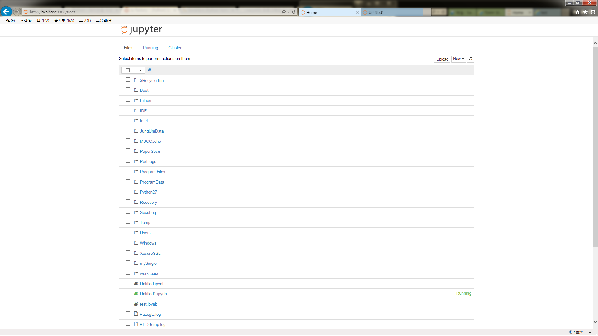
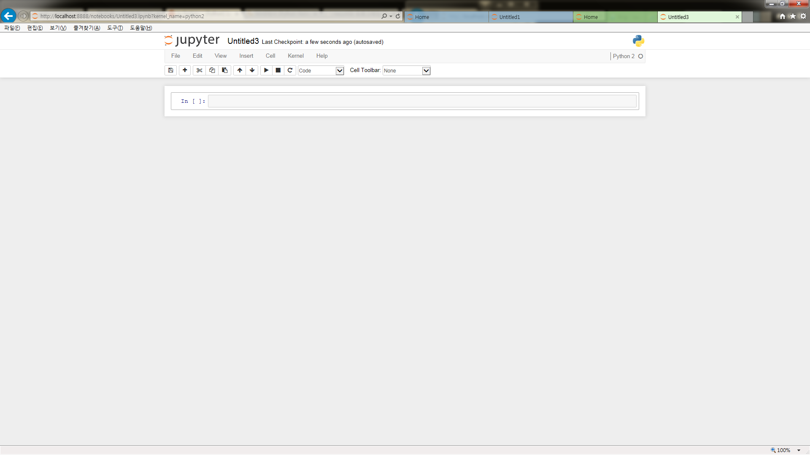
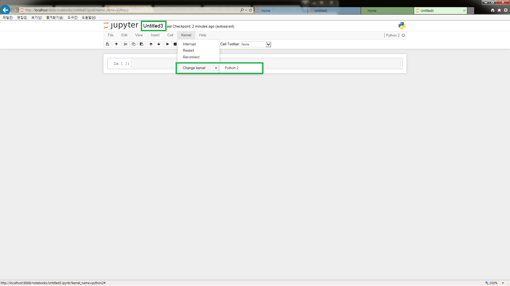
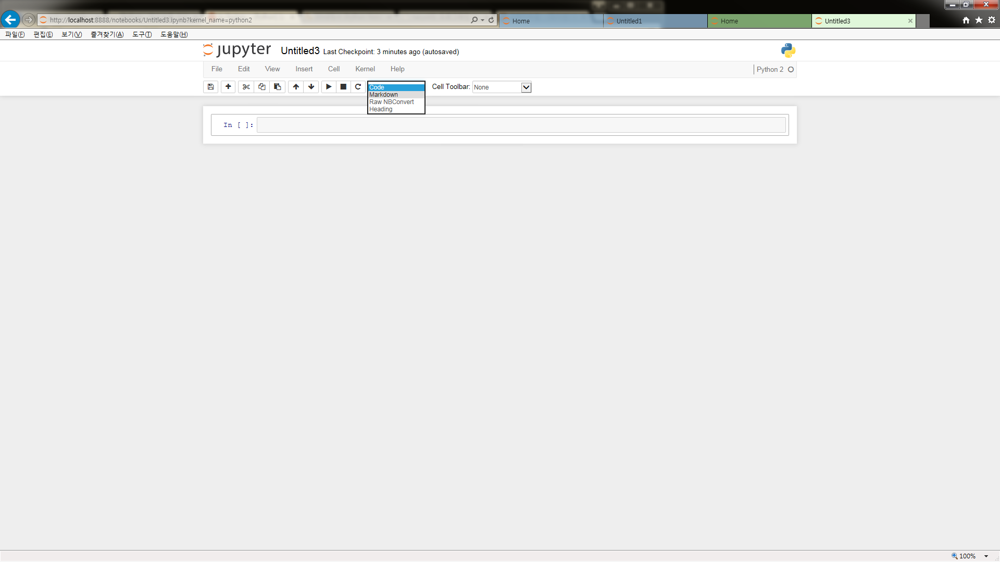
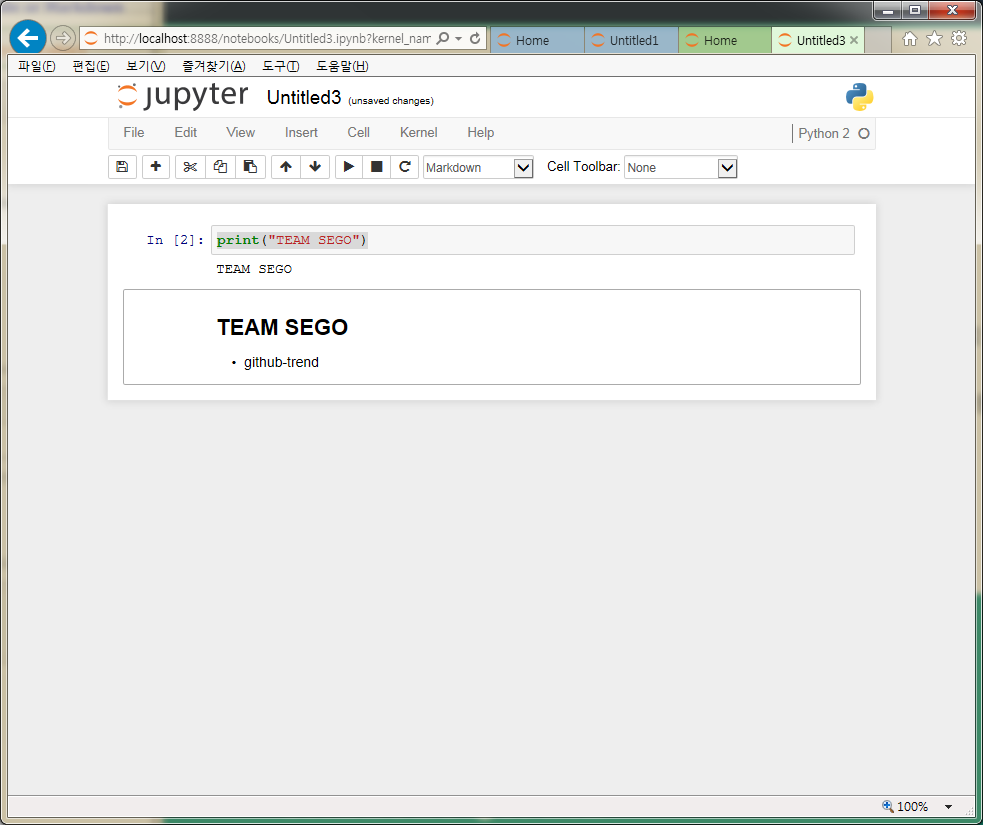
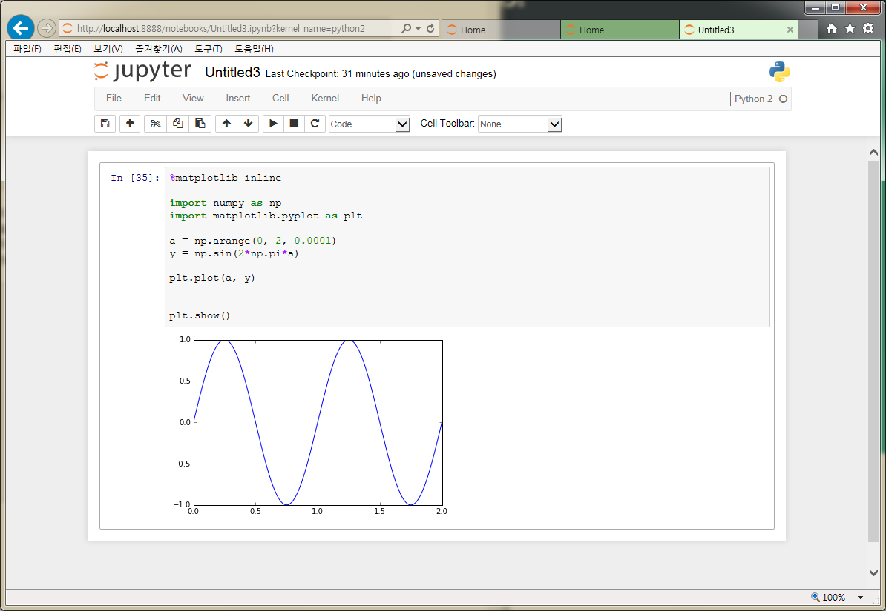

# data-science-ipython-notebooks

- 페이지 링크: https://github.com/donnemartin/data-science-ipython-notebooks

 

## 소개
 ipython은 python을 데이터분석, 통계, 그래프 기능 등 리포팅 기능에 좀 더 최적화 시킨 것으로써 웹에서 프로그램이 가능하고 그 결과를 xml이나 html형식으로 바로 볼 수 있는, 기존의 python보다 좀 더 인터프리터가 쉽게 shell기능을 더한 것입니다.
 여기에 안드로이드 폰 GUI 환경대신에 ipython GUI로 제공되는, python에 최적화된 IDE가 ipython notebook 입니다.


## 설치 
 1. 윈도우에 파이썬 설치하기
 	- 파이썬다운로드 링크 : http://python.org/download
 	- 설치가 완료되면 C:/Python27 디렉토리 생성 확인

 2. 환경변수에 파이썬 추가하기
 	- cmd창에 아래의 명령어를 입력한 후 "path"를 실행하여 정상적으로 추가되었는지 확인

 	 ```
	 setx PATH "C:\Python27;C:\Python27\Scripts;C:\Python27\Lib\site-packages"
	 ```
	- "python"을 입력하여 실행되는지 확인

 3. 패키지 관리 도구 설치하기
 	- get-pip.py 다운로드 : https://raw.githubusercontent.com/pypa/pip/master/contrib/get-pip.py
 	- cmd창에 아래의 명령어를 입력

 	  ```
	  python get-pip.py
	  ```
	
	혹은 위의 명령어가 실행이 안될 경우 아래 명령어를 실행
	 ```
	 easy_install pip
	 ```

 4. iPython 설치하기
 	- 아래 명령어를 순서대로 실행한 후 "python"을 실행하여 확인
 	```
	pip install distribute
	pip install pyreadline
	pip install ipython 
	```

 5. ipython 라이브러리 설치하기
 	- 아래 명령어를 순서대로 실행
 	```
	pip install jinja2 
	pip install sphinx 
	pip install pyzmq 
	pip install pygments 
	pip install tornado 
	pip install nose 
	pip install readline
	```
	- 파이썬 확장 라이브러리들 모음 사이트 : http://www.lfd.uci.edu/~gohlke/pythonlibs/

	- "ipython notebook"을 실행하면 웹 브라우저가 열림

 ##### 최근 ipython notebook => jupyther로 업그레이드 되었습니다.(파이썬2 뿐만 아니라 파이썬3도 지원) 
   업그레이드 방법 : pip install --upgrade ipython / pip install jsonschema 실행 후 "ipython notebook" 재실행

## 사용방법
 1. 첫번째 로컬호스트 로딩 화면
 

 2. py파일 생성하기
  
 

 3. 메뉴 : untitled3을 클릭하여 파일명 변경 가능
  
 
 
 실행 : Ctrl + Enter
 New Code line : Alt + Enter

 4. Example
 
 
 jupyther notebook에서는 매직 커맨드를 통해 단순히 파이썬 코드를 실행시키는 것 이외에도 다양한 작업을 수행할 수 있도록 도와줍니다. 예를 들어 %%html을 첫 줄에 작성하고, 아래부터는 html코드를 작성하면 html 코드를 직접 결과 블록에 삽입할 수도 있습니다.  
 

 아래는 matplotlib를 이용하여 함수 그래프를 표현해 보았습니다.
 


#### ipython-notebook을 직접 사용해보니 소스와 결과를 바로 바로 볼 수 있고, 웹 어플리케이션이니 여러 사람이 함께 공유할 수 있어서 좋은 것 같네요. 추천!!
